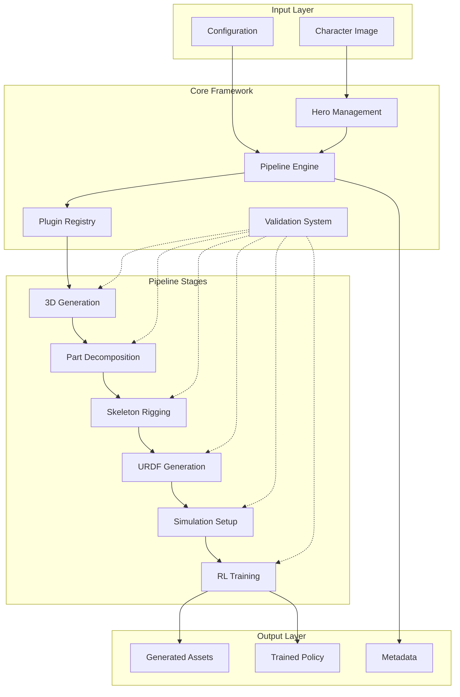

# Architecture Overview

Tung Playground is designed as a modular, extensible framework that transforms character images into trained AI agents through a sophisticated pipeline architecture.

## System Architecture

### High-Level Design



## Core Principles

### 🔧 Modular Design

Each component is designed for independence and replaceability:

- **Loose Coupling**: Components communicate through well-defined interfaces
- **High Cohesion**: Each module has a single, clear responsibility
- **Plugin Architecture**: Easy to add, remove, or replace functionality

### ⚡ Async-First

Built for performance and scalability:

- **Non-blocking Operations**: Pipeline stages run asynchronously
- **Concurrent Execution**: Multiple heroes can be processed simultaneously
- **Resource Management**: Intelligent batching and resource allocation

### 🛡️ Type Safety

Comprehensive type system for reliability:

- **Static Type Checking**: Full type hints throughout the codebase
- **Runtime Validation**: Pydantic models for data validation
- **Error Prevention**: Catch issues at development time

### 📊 Observable

Built-in monitoring and debugging:

- **Rich Logging**: Detailed progress tracking and error reporting
- **Metrics Collection**: Performance and quality metrics at each stage
- **Asset Tracking**: Complete audit trail of all generated files

## Key Components

### 1. Hero Management System

The `Hero` class represents a character throughout the pipeline:

```python
@dataclass
class Hero(BaseModel):
    id: str
    name: str
    status: HeroStatus
    assets: HeroAssets
    config: Dict[str, Any]
    processing_log: List[Dict[str, Any]]
```

**Responsibilities:**
- Track processing state and progress
- Manage generated assets and metadata
- Provide configuration access
- Maintain processing history

### 2. Pipeline Engine

The `Pipeline` class orchestrates stage execution:

```python
class Pipeline:
    async def execute(self, hero: Hero) -> List[StageResult]
    async def execute_batch(self, heroes: List[Hero]) -> Dict[str, List[StageResult]]
```

**Features:**
- Async execution with retry logic
- Input/output validation
- Error handling and recovery
- Progress tracking and logging

### 3. Plugin Registry

Dynamic plugin discovery and management:

```python
class PluginRegistry:
    def register(self, name: str, plugin_type: str, class_type: Type)
    def get(self, plugin_type: str, name: str) -> Type
    def create_instance(self, plugin_type: str, name: str) -> Any
```

**Capabilities:**
- Automatic plugin discovery
- Dependency management
- Configuration injection
- Instance caching

### 4. Configuration System

Hierarchical configuration management:

```yaml
# Global settings
global:
  log_level: INFO
  max_workers: 4

# Stage-specific settings
stages:
  generation:
    output_format: "obj"
    quality_threshold: 0.7
```

**Features:**
- YAML-based configuration
- Environment-specific overrides
- Stage-specific settings
- Runtime configuration updates

## Data Flow

### 1. Hero Creation

```python
hero = tp.create_hero("character", "image.png")
```

- Creates Hero instance with unique ID
- Sets up asset tracking
- Initializes processing log
- Validates input image

### 2. Pipeline Configuration

```python
pipeline = tp.create_pipeline("default")
pipeline.add_stages([...])
```

- Loads configuration from YAML
- Instantiates pipeline stages
- Applies stage-specific settings
- Sets up validation rules

### 3. Stage Execution

For each stage in the pipeline:

1. **Input Validation**: Verify required assets exist
2. **Processing**: Execute the stage algorithm
3. **Output Validation**: Verify expected outputs
4. **Asset Update**: Register new assets with hero
5. **Logging**: Record progress and metrics

### 4. Result Aggregation

```python
results = await pipeline.execute(hero)
```

- Collect results from all stages
- Update hero status and metadata
- Generate processing summary
- Save final state

## Error Handling

### Validation Strategy

**Input Validation:**
- Check file existence and format
- Validate data structure integrity
- Verify dependency requirements

**Output Validation:**
- Confirm expected files generated
- Check quality metrics against thresholds
- Validate file format compliance

### Recovery Mechanisms

**Retry Logic:**
- Configurable retry attempts
- Exponential backoff delays
- Stage-specific retry policies

**Graceful Degradation:**
- Continue pipeline on non-critical failures
- Generate fallback outputs when possible
- Maintain partial results for debugging

## Extensibility Points

### 1. Custom Pipeline Stages

Implement the `PipelineStage` interface:

```python
class CustomStage(PipelineStage):
    async def process(self, hero: Hero) -> StageResult:
        # Your implementation here
        pass
    
    def validate_inputs(self, hero: Hero) -> bool:
        # Input validation logic
        pass
    
    def validate_outputs(self, result: StageResult) -> bool:
        # Output validation logic
        pass
```

### 2. Plugin Development

Register plugins automatically:

```python
@plugin("custom_type", "my_plugin")
class MyPlugin(PipelineStage):
    PLUGIN_TYPE = "custom_type"
    VERSION = "1.0.0"
    # Implementation...
```

### 3. Configuration Extensions

Add custom configuration sections:

```yaml
custom_stage:
  algorithm: "advanced"
  parameters:
    threshold: 0.9
    iterations: 100
```

### 4. Asset Types

Extend the asset system:

```python
class AssetType(str, Enum):
    CUSTOM_OUTPUT = "custom_output"
    # Add your asset types
```

## Performance Considerations

### Memory Management

- **Streaming Processing**: Large files processed in chunks
- **Garbage Collection**: Explicit cleanup of temporary resources
- **Memory Pooling**: Reuse allocations where possible

### Parallel Execution

- **Stage Parallelism**: Independent stages run concurrently
- **Batch Processing**: Multiple heroes processed together
- **Resource Scheduling**: Intelligent allocation of compute resources

### Caching Strategy

- **Plugin Instances**: Cache plugin objects for reuse
- **Intermediate Results**: Optional caching between stages
- **Configuration**: Cache parsed configuration data

## Next Steps

- **[Core Components](./core-components.md)**: Deep dive into individual components
- **[Pipeline System](./pipeline.md)**: Detailed pipeline mechanics
- **[Plugin Architecture](./plugins.md)**: Creating and managing plugins
- **[Configuration System](./configuration.md)**: Advanced configuration patterns