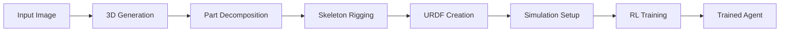

# Introduction

Welcome to **Tung Playground** - a comprehensive framework for generating AI heroes from images and training them in physics simulators using reinforcement learning.

## What is Tung Playground?

Tung Playground implements a complete AIGC (AI-Generated Content) pipeline that transforms a single character image into a fully-trained, locomotion-capable agent in a physics simulation environment.

### Complete Pipeline Flow



The framework processes your hero through six distinct stages:

1. **🖼️ Image-to-3D Generation**: Convert 2D character images to 3D meshes using state-of-the-art AI models
2. **🧩 Part Decomposition**: Intelligently segment the 3D mesh into semantic body parts
3. **🦴 Skeleton Rigging**: Generate an articulated skeleton with proper joint hierarchies
4. **🤖 URDF Generation**: Create physics-ready robot descriptions with mass, inertia, and collision properties
5. **🌍 Simulation Setup**: Deploy the character in MuJoCo or Isaac Lab environments
6. **🧠 RL Training**: Train locomotion policies using reinforcement learning algorithms

## Key Features

### 🔧 Modular Architecture
- **Plugin-based System**: Each pipeline stage is independently replaceable
- **Hot-swappable Algorithms**: Easily switch between different AI models and methods
- **Extensible Design**: Add new capabilities without modifying core framework

### ⚡ Performance & Scalability
- **Async Pipeline Execution**: Concurrent processing with automatic retry logic
- **Batch Processing**: Handle multiple heroes simultaneously
- **Distributed Computing**: Scale across multiple machines and GPUs

### 🛡️ Production Ready
- **Type Safety**: Comprehensive type hints and validation throughout
- **Error Recovery**: Robust error handling with detailed logging
- **Configuration Management**: YAML-based hierarchical configuration system
- **Asset Tracking**: Complete audit trail of all generated files

### 🎯 Developer Experience
- **Rich Documentation**: Comprehensive guides and API references
- **Easy Integration**: Well-defined interfaces for adding new algorithms
- **Debug Tools**: Built-in validation and troubleshooting utilities
- **Example Gallery**: Ready-to-run examples and tutorials

## Why Tung Playground?

### For Researchers
- **Rapid Prototyping**: Test new AIGC algorithms in a complete pipeline
- **Standardized Evaluation**: Compare different methods using consistent metrics
- **Reproducible Results**: Version-controlled configurations and deterministic execution

### For Developers
- **Production Framework**: Industrial-strength architecture for real applications
- **Flexible Integration**: Works with existing ML workflows and infrastructure
- **Open Source**: MIT license with active community contributions

### For Content Creators
- **Automated Workflow**: Transform character concepts into interactive agents
- **High Quality Output**: State-of-the-art AI models for professional results
- **Customizable Pipeline**: Tune each stage for specific artistic requirements

## Supported Technologies

### AI/ML Frameworks
- **3D Generation**: Meshy AI, Wonder3D, Era3D, Commercial APIs (Tripo)
- **Part Decomposition**: PartCrafter, Custom segmentation algorithms  
- **RL Training**: PPO, SAC, TD3 with popular RL libraries

### Physics Simulators
- **MuJoCo**: High-performance physics for robotics research
- **Isaac Lab**: GPU-accelerated simulation for large-scale training
- **Custom Adapters**: Extensible interface for other simulators

### File Formats
- **3D Models**: OBJ, PLY, STL, COLLADA, glTF
- **Robot Descriptions**: URDF, SDF, MJCF
- **Policies**: PyTorch, ONNX, custom formats

## Quick Example

Here's how simple it is to create and train a hero:

```python
import tung_playground as tp

# Create a hero from an image
hero = tp.create_hero("my_character", "character.png")

# Set up the complete pipeline
pipeline = tp.create_pipeline()
pipeline.add_stages([
    tp.MeshyGenerator("generation"),
    tp.PartCrafterDecomposer("decomposition"),
    tp.AutoRigger("rigging"),
    tp.URDFBuilder("urdf"),
    tp.MuJoCoAdapter("simulation"),
    tp.PPOTrainer("training")
])

# Execute the full pipeline
results = await pipeline.execute(hero)

# Your hero is now ready for action!
print(f"Hero {hero.name} is ready with policy at {hero.assets.trained_policy}")
```

## Getting Started

Ready to create your first AI hero? Jump to our [Quick Start Guide](./getting-started/quick-start.md) to get up and running in minutes.

For a deeper understanding of the system architecture, check out the [Architecture Overview](./architecture/overview.md).

## Community & Support

- **📚 Documentation**: Comprehensive guides and API references
- **🐛 Issues**: Report bugs and request features on GitHub
- **💬 Discussions**: Join our community for help and collaboration
- **🔔 Updates**: Follow development progress and releases

---

*Tung Playground makes AI-powered character creation accessible, scalable, and production-ready. Welcome to the future of interactive content generation!*